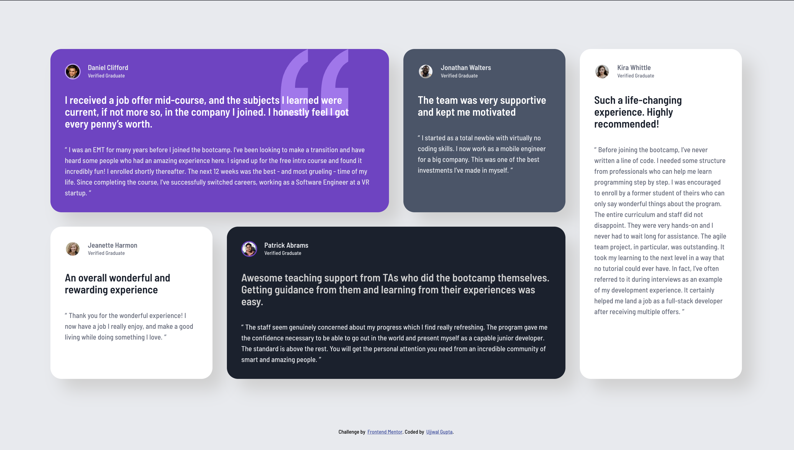

# Frontend Mentor - Testimonials solution

This is a solution to the [Testimonials challenge on Frontend Mentor](https://www.frontendmentor.io/challenges/testimonials-grid-section-Nnw6J7Un7). Frontend Mentor challenges help you improve your coding skills by building realistic projects.

## Table of contents

- [Overview](#overview)
  - [Screenshot](#screenshot)
  - [Links](#links)
- [Getting Started](#getting-started)
  - [Start The Development Server](#1-start-the-development-server)
  - [Preview The Production Build](#2-preview-the-production-build)
  - [Linting & Formatting](#linting--formatting)
  - [Project Structure](#project-structure)
- [My process](#my-process)
  - [Built with](#built-with)
  - [What I learned](#what-i-learned)
  - [Continued development](#continued-development)
  - [Useful resources](#useful-resources)
- [Author](#author)
- [License](#license)

## Overview

### Screenshot



### Links

- Solution URL: [Solution](https://github.com/guptaujjwal1128/testimonials)
- Live Site URL: [Live Site](https://guptaujjwal1128.github.io/testimonials/)

## Getting Started

### 1. Start The Development Server

```sh
npm install
npm run dev
```

### 2. Preview The Production Build

```sh
npm run build
npm run preview
```

### Linting & Formatting

```sh
npm run fmt
npm run lint
```

### Project Structure

```
src/
  App.tsx         # Main React component
  main.tsx        # Entry point
  index.css       # Global styles
public/           # public assets like favicon icon
src/              # sources
src/assets/       # assets that need optimisations by vite
  index.html      # HTML template
vite.config.ts    # Vite configuration
eslint.config.js  # ESLint Flat Config
tsconfig*.json    # TypeScript configs
.prettierrc       # Prettier config
```

## My process

### Built with

- Semantic HTML5 markup
- Flexbox
- Responsive Design
- Accesibility
- [Vite](https://vite.dev/) - Module Bundler
- [React + Typescript](https://reactjs.org/)

### What I learned

- HTML structuring
- Responsive Design
- Accessibility

### Continued development

- Frontend Mentor Learning Path
- React
- Redux
- Next
- Frontend System Design

### Useful resources

Frontend Mentor Community

## Author

- Website - [Ujjwal Gupta](https://www.linkedin.com/in/ujjwal-gupta-671588154/)
- Frontend Mentor - [@guptaujjwal1128](https://www.frontendmentor.io/profile/guptaujjwal1128)
- Twitter - [@guptaujjwal1128](https://www.twitter.com/guptaujjwal1128)

## License

[MIT](./LICENSE)
